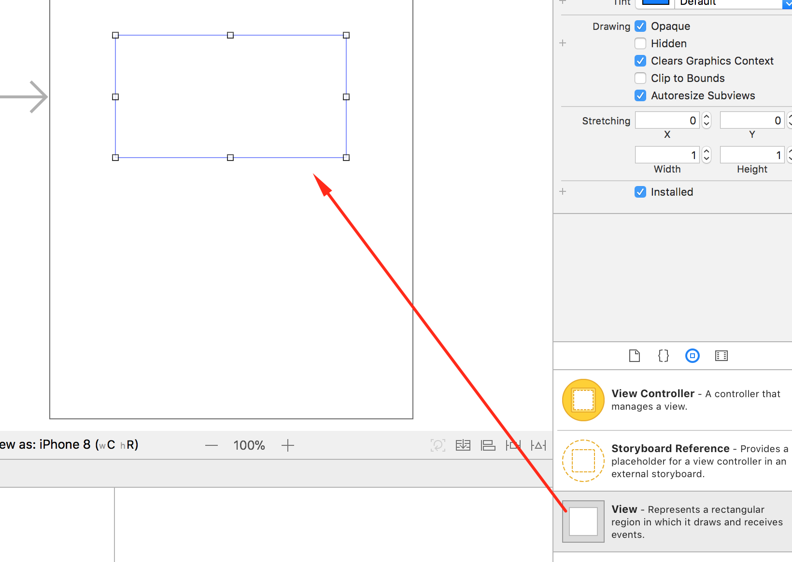
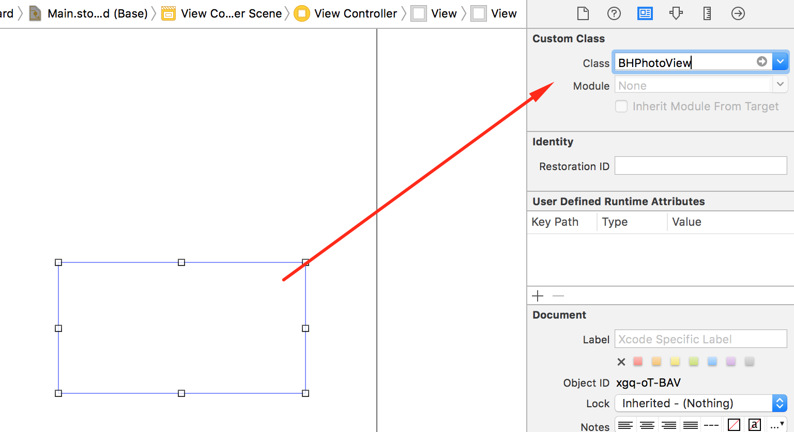
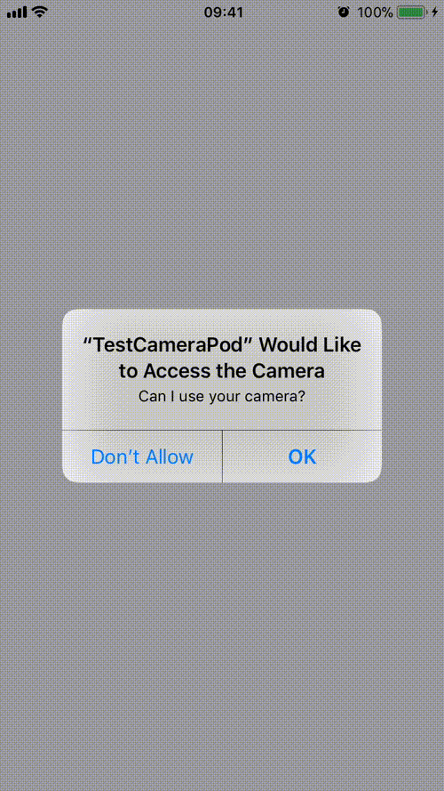

# BHPhotoView
A ultra simple camera viewer for UIView


## Instalation
Requirements:
* Swift 4
* iOS 10.0+
* XCode 9+

Using [cocoapods](https://cocoapods.org/):

```ruby
target 'YouProject' do
  # Comment the next line if you're not using Swift and don't want to use dynamic frameworks
  use_frameworks!

  # Pods for TestCameraPod
  # this is temporary due to cocoapods publish issue.
  pod 'BHPhotoView', :git => 'https://github.com/benhurott/BHPhotoView'

end
```

## Usage

### 1 - Creating Code Base
Add a UIView to your screen:



<br />
Set your uiview class to `BHPhotoView`:



<br />
In your `ViewController`:

Import the lib:
```swift
import UIKit
import BHPhotoView //<-- here

class ViewController: UIViewController {

}
```

Link a `IBOutlet` from your UIView:


### 2 - Configuring for Camera
In your `Info.plist` project, set the `Privacy - Camera Usage Description` with any text you want.


In your `ViewController`, add the `BHPhotoViewDelegate`:
```swift
extension ViewController: BHPhotoViewDelegate {
    func onPhotoCaptured(_ view: BHPhotoView, photo: UIImage) {
        // when photo has been taken, this method will be called.
    }
    
    func onPhotoCapturingError(_ view: BHPhotoView, error: BHPhotoViewError) {
        // if some error occurs, this method has been called.
    }
}
```

Set the delegate and camera position:
```swift
import UIKit
import BHPhotoView

class ViewController: UIViewController  {

    @IBOutlet weak var photoView: BHPhotoView!
    
    override func viewDidLoad() {
        super.viewDidLoad()

        self.photoView.delegate = self
        self.photoView.cameraPosition = .front
    }
}
```

(OPTIONAL) Set preview orientation:
```swift
import UIKit
import BHPhotoView

class ViewController: UIViewController  {

    @IBOutlet weak var photoView: BHPhotoView!
    
    override func viewDidLoad() {
        super.viewDidLoad()

        self.photoView.delegate = self
        self.photoView.cameraPosition = .front

        self.photoView.previewOrientation = AVCaptureVideoOrientation.landscapeLeft
    }
}
```

### 3 - Starting and capturing from camera
To start camera, call the `start` method:
```swift
override func viewDidLoad() {
    super.viewDidLoad()
    
    self.photoView.delegate = self
    self.photoView.cameraPosition = .front

    self.photoView.start()
}
```

To capture photo, call the `capturePhoto` method:
```swift
@IBAction func onTouchMyButton(_ sender: Any) {
    // when you call this method and photo has been taken,
    // the delegate methods will be called.
    self.photoView.capturePhoto()
}
```

To stop streaming, use the `stop` method:
```swift
@IBAction func onTouchMyButton(_ sender: Any) {
    self.photoView.stop()
}
```

### 4 - Result =)



## Advanced
If you want to use some "advanced" features, take a look at [ADVANCED DOCS](docs/ADVANCED.md).

## Release Notes

### 0.12.2
* Fix: exposing public `frame:` contructor.

### 0.12.1
* Fix: fixing crash on re-use photo settings.

Breaking change:
* Not default flashMode is `off`.

### 0.12.0
* Feat: exposed properties
    * Now more properties are exposed =).

### 0.11.0
* Feat: customization
    * Now you can access some internal props for advanced customization.

Breaking changes:
* The method `.start(cameraPosition: .front)` is now `.start()`
* The method `.capturePhoto(usingSettings: photoSettings)` is removed. Set the `.photoSettings` property instead.

### 0.10.0
* Feat: adding `stop` method.

### 0.9.1
* Fix: cocoapods validation.

### 0.9.0: First release o/